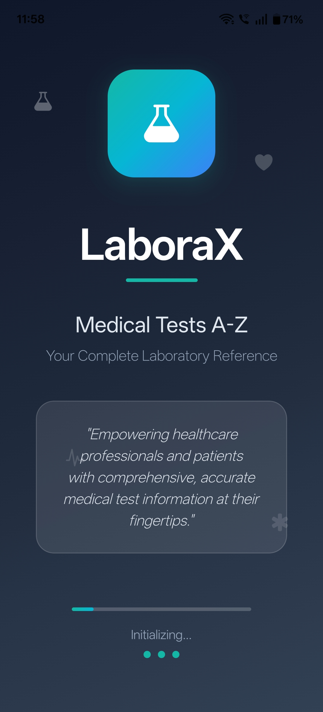
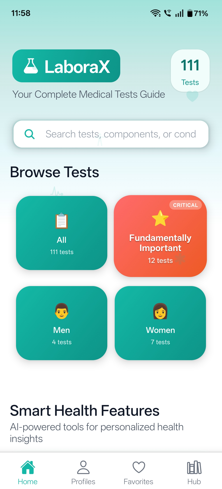
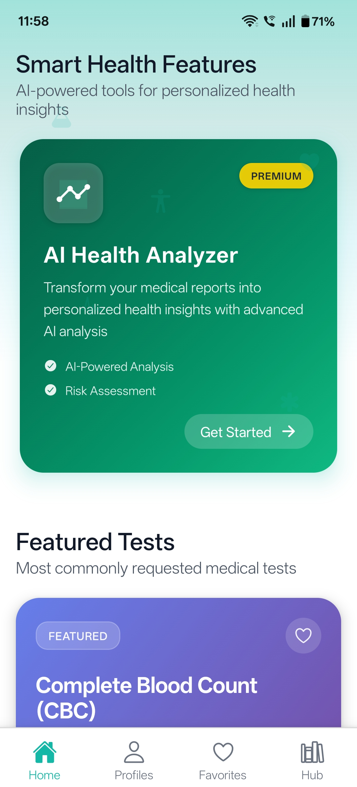
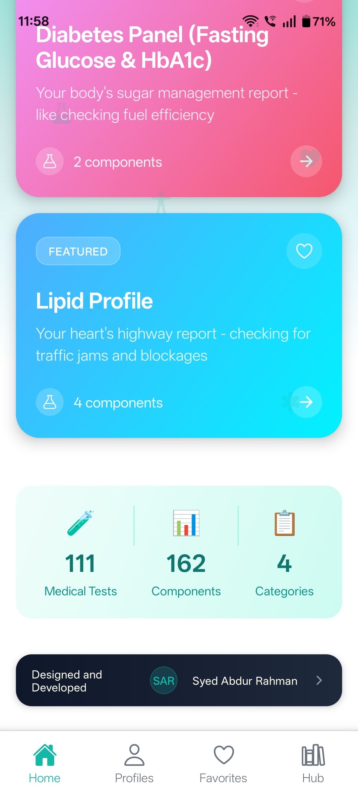
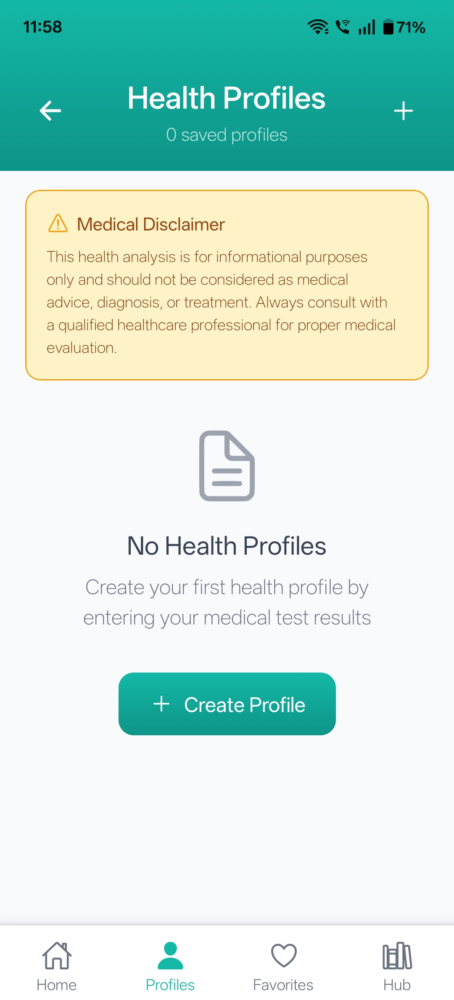

# 🧪 LaboraX – Modern Digital Health Companion

<p align="center">
   
   
   
   
   
</p>

<p align="center">
   <b>A comprehensive mobile application that makes medical laboratory tests easy to understand for patients, students, and healthcare professionals.</b><br><br>
   <i>Built with React Native & Expo — bridging the gap between medical complexity and clarity.</i>
</p>

<p align="center">
  <b>Contact on below email for Code and Collaboration, this App is not for free.</b><br>
   
</p>


<p align="center">
   <a href="#features"></a>
   <a href="LICENSE"></a>
   <a href="https://reactnative.dev/"></a>
   <a href="https://expo.dev/"></a>
</p>

---

## 🩺 Overview

LaboraX is designed to **demystify medical lab reports**, making them understandable and actionable for everyone.  
It provides:  

- Clear explanations of 200+ medical tests  
- AI-powered report analysis & insights  
- Personalized health profiles  
- Favorites & bookmarks for quick access  
- A modern, intuitive cross-platform interface  

Whether you’re a **patient, student, or clinician**, LaboraX helps **make sense of health data quickly and confidently**.

---

## ✨ Features

```text
📚 Comprehensive Medical Test Database
   - 200+ tests with plain-language explanations
   - Gender- and age-specific normal ranges
   - Clinical significance for each test

🔍 Smart Search
   - Search by test name, components, or related conditions
   - AI-powered suggestions for faster results

🤖 AI-Powered Insights
   - Automated interpretation of lab reports
   - Actionable recommendations
   - Early detection cues

👤 Personalized Health Profiles
   - Create & manage multiple profiles
   - Tailored insights based on health history

⭐ Favorites & Quick Access
   - Bookmark frequently referenced tests
   - Instant access to saved reports

🎨 Modern UI/UX
   - Responsive and intuitive design
   - Smooth Lottie animations
   - Light/Dark theme support

🛡️ Secure Data Handling
   - Local-first storage (no cloud by default)
   - Best-in-class validation & encryption

📱 Cross-Platform
   - Android, iOS, and Web via Expo
```

---

## 📱 Screens & Navigation

- **SplashScreen** → Animated app entry
- **HomeScreen** → Featured tests, search & categories
- **CategoryTestsScreen** → Browse tests by category
- **TestDetailScreen** → Detailed explanations & ranges
- **FavoritesScreen** → Quick-access bookmarks
- **HealthProfileScreen** → Manage personal profiles
- **EnhancedHealthProfileScreen** → Advanced analytics
- **ReportScanScreen** → AI-based report scanner
- **SymptomCheckerScreen** → Match symptoms to tests
- **PopulationInsightsScreen** → Global trends & insights
- **AboutScreen** → App info & credits

> 🔗 Navigation is handled by **React Navigation** (stack + tabs) with custom theming.

---

## 🧑‍💻 Tech Stack

- **React Native** (0.79.5)  
- **Expo** (~53.0.20)  
- **React Navigation** (stack + bottom-tabs)  
- **React Native Paper** (UI components)  
- **Lottie** (animations)  
- **AsyncStorage** (local persistence)  
- **Custom Theming** (colors, typography)  

---

## 🛡️ Security & Privacy

- Local-first storage ensures data **never leaves your device** by default  
- All sensitive operations validated via `utils/security.js`  
- Aligned with **HIPAA/GDPR-inspired practices**

---

## 🧩 Extensibility & Customization

- **Add New Tests:** Update datasets in `data/medicalTests.js`  
- **UI Customization:** Edit `theme/colors.js` & `theme/typography.js`  
- **Add Screens/Features:** Create new components/screens & register in `navigation/AppNavigator.js`  

---

## 🧪 Testing & Quality

- Modular and reusable components for maintainability  
- Linting with Babel  
- Manual and automated testing recommended before production  

---

## 📄 License

This project is licensed under the **MIT License**. See [LICENSE](LICENSE) for details.

---

## 🙏 Credits

- **Medical references:** Mayo Clinic, LabTestsOnline, CDC  
- **Icons:** [Ionicons](https://ionicons.com/), [Expo Vector Icons](https://docs.expo.dev/guides/icons/)  
- **UI Inspiration:** Material Design, Dribbble  

---

## 🌟 Why LaboraX?

LaboraX bridges complex medical data and human understanding:

- **Patients:** Understand reports, gain confidence, take control of health  
- **Clinicians:** Save time, improve communication, increase trust  
- **Students:** Learn medical tests interactively and visually  

LaboraX is **more than an app** — it’s a **health empowerment tool**.

---

## 📬 Contact & Support

For inquiries regarding the **source code** or collaborations, feel free to reach out:

- **Email:** [rahmansyed862@gmail.com](mailto:rahmansyed862@gmail.com)  
- **Mobile / Whatsapp:** +91-8639279800
- **LinkedIn:** [Your LinkedIn Profile](https://www.linkedin.com/in/syedabdurrahmanuddin/)

